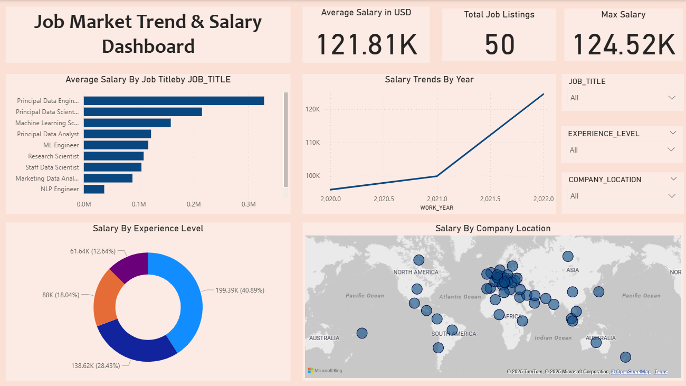

# 💼 Job Market Salary Dashboard (Power BI)

This Power BI dashboard analyzes salary trends across multiple dimensions:

## 📊 Visuals Included:
- 📍 Average Salary by Location
- 🧠 Salary by Experience
- 🧑‍💼 Average Salary by Job Title
- 📈 Salary Trends by Year

## 🛠️ Tools Used:
- VS Code
- Snowflake (Data Source)
- Power BI Desktop

## 📁 File:
- `Job Market Trend & Salary Dashboard.pbix` – The complete dashboard

## 📸 Preview:
> 

---

📌 **Note:** If you're viewing this repo and want to use the dashboard, open the `.pbix` file using Power BI Desktop.
